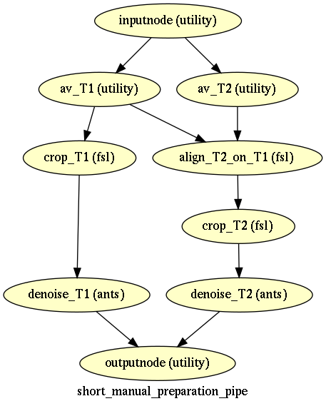
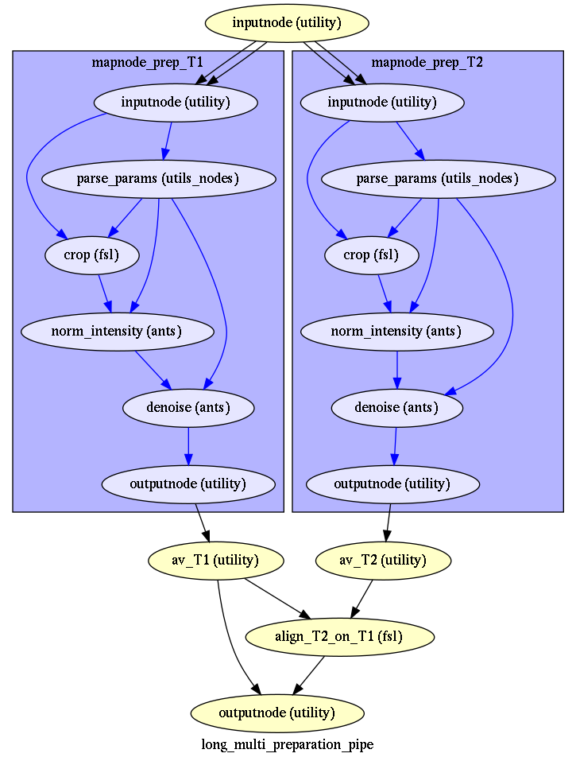

.. _pipelines:

Pipelines
_________
.. _data_prep:

Data preparation
----------------

Short data preparation
~~~~~~~~~~~~~~~~~~~~~~

Short data preparation corresponds to the pipelines where T1 and T2 images are averaged by modality from the beginning, and T2 is aligned to T1, then cropped or betcropped, and denoised.

The "auto"" version corresponds to :class:`short data preparation <macapype.pipelines.prepare.create_short_preparation_pipe>` with "betcrop" option (using :class:`T1xT2BET <macapype.nodes.extract_brain.T1xT2BET>`)

The "manual" version corresponds to :class:`short data preparation <macapype.pipelines.prepare.create_short_preparation_pipe>` with "crop" option, and specify crop box in args for each subject in individual params

.. _short_prep:

.. |logo2| image:: ./img/short_auto_preparation_pipe/graph.png
    :scale: 100%

.. table::
   :align: center

   +---------+---------+
   | |logo1| | |logo2| |
   +---------+---------+

The version with crop are used in :ref:`marmoset example <plot_segment_marmo_ants_based>`, the version with betcrop is used in both macaque examples with
:ref:`SPM <plot_segment_macaque_spm_based>` and :ref:`ANTS <plot_segment_macaque_ants_based>`

Long data preparation
~~~~~~~~~~~~~~~~~~~~~~~~~~~~~~~~

In some cases, you may want some processing done prior to the alignement, if T1 and T2 are very different.

In this case, after aligning and averaging by modality (all T1s -> average_T1), you may crop, debias (N4) and denoise each image (average_T1 and average T2) indendantly before aligning average_T2 to average_T1 (:class:`long single data preparation <macapype.pipelines.prepare.create_long_single_preparation_pipe>`)

But in a very specific case, where the data of multiple sessions have been acquired with different settings (e.g. antenna contrast), you may have even all multiple modality data preprocessed (reorient, cropped, debiased, denoised) indendantly before being averaged and aligned by modality, and then av_T2 aligned to av_T1 (:class:`long multi data preparation <macapype.pipelines.prepare.create_long_multi_preparation_pipe>`)

.. _long_prep:

.. table::
   :align: center

   +---------+---------+
   | |logo3| | |logo4| |
   +---------+---------+

The short version is used for the :ref:`baboon example <plot_segment_baboon_ants_based>`, the long version has been tested on a data set with multiple T1s (not shown in examples).

Options
~~~~~~~~~

Reorient sub-pipeline
**********************

For all the preparation pipelines, it is possible to add at the beginning of the pipeline a "reorient" subpipelines by specifying
An example can be found in :ref:`macaque sphinx <plot_segment_sphinx_macaque_ants_based>`

Denoise and denoise_first
**************************

By default, denoising is done at the end of the preparation pipeline, on the cropped data. It is however possible to move the denoise at the beginning at the pipeline, with option denoise first. *N.B.:  This option is only available in long preparation (single and multi) so far*
