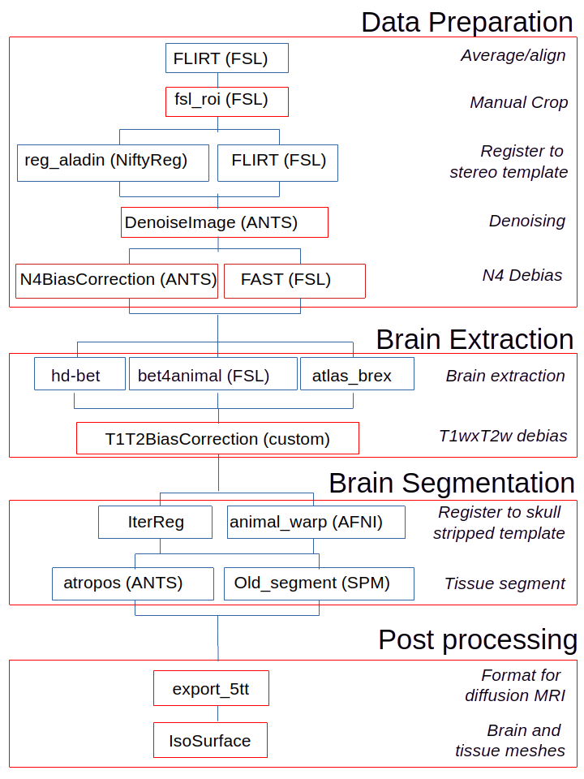

# Summary

Although brain anatomical Magnetic Resonance Imaging (MRI) processing is largely standardized and functional in humans, it remains a challenge to define robust processing pipelines for the segmentation of non-human primate (NHP) images. To unify the processing of NHP anatomical MRI, we propose Macapype, an open-source framework to create custom pipelines for data preparation, brain extraction, and brain segmentation.

# Statement of Need
Non-human primates (NHPs) are increasingly used for neuroimaging studies due to the progress of MR acquisitions and the promises it holds in the field of neuroscience [@milham2018open]. Despite the standardization of MRI processing in humans with several well-known software available, such as AFNI [@cox1996afni], FSL [@smith2004advances], SPM [@tierney2025SPM], Niftyreg [@Modat2014niftyreg] and ANTS [@avants2011reproducible], defining robust processing pipelines for NHP anatomical image segmentation remains difficult.

# State of the field
Two categories of methods have been proposed to address the issue of NHP anatomical MR image segmentation. The first category corresponds to particular implementations for PNH images of existing human-MRI software such as NHP-Freesurfer and CIVET-Macaque, respectively relying on human-MRI software Freesurfer [@fischl2012freesurfer] and  CIVET [@lepage2021civet]. The second category relies on the use of deep-learning and machine learning techniques, such as U-Nets [@Wang2021unet], for example nBEST [@ZHONG2024120652] to provide brain mask, segmentation of GM, WM and subcurtical nuclei, and requires the use of GPUs. Most existing software perform relatively badly on small NHP species such as marmoset due to the lack of flexibility in the processing steps and the variability of brain peculiarities among NHP species.

# Software design
In this context, we propose a general framework for the tissue segmentation of non-human primate brain MR images that can provide multiple pipelines to adapt to a variety of image qualities and species. This open-source framework, named Macapype, is built on the Nipype [gorgolewski2011nipype] , a widely used Python framework for human MRI analysis.

The Macapype package was specifically designed to provide wraps of custom tools specific to NHP anatomical MRI preprocessingn, as well pipelines and workflows to achieve high-quality automated tissue segmentation of NHP anatomical images. In particular, the tuning of parameters for different species, should be possible if needed via the use parameters files

# Pipelines

Macapype provides configurable pipelines organized in three steps: data preparation, brain extraction, and brain segmentation. Post-processing allows for conversion to formats for further processing outside Macapype.

## Data Preparation Pipeline

The data preparation pipeline is specified in a JSON parameters file and depends on individual parameters. If cropping parameters are absent, Macapype performs an automated but low-precision crop. The input volume is reoriented in a standard space, and denoising and debiasing steps are performed.

## Brain Extraction Pipeline

For skull-stripping step, Macapype offers a choice between AtlasBRex [@lohmeier2019atlasbrex] and bet4animal, an optimized version of brain extraction tool (BET in FSL) for NHP. HD-BET [@Isensee2019hdbet] is also available for deep-learning-based brain extraction.

## Tissue Segmentation Pipeline

Tissue segmentation is template-based and can be done in template or native space. Macapype provides templates for macaque, marmoset, baboon, and chimpanzee. T1xT2 debias is applied, followed by normalization and segmentation using ANTS-based Atropos or SPM12-based old segment.

## Post-Processing Pipeline

For compatibility with further processing, Macapype provides formatting options, such as the 5tt file from MRTrix [@tournier2019mrtrix3] for further processing of diffusion MRI  and meshes in STL format for 3D printing.

# Research impact statement

Macapype is compatible with FAIR principles, storing all processing steps and parameters in a JSON file. It allows evaluation of results at different preprocessing steps and is tested on images from the PRIME-DE database  [@milham2018open] and is listed as a software solution on PRIME-RE [@messinger2021collaborative].

# AI usage disclosure

No generative AI tools were used in the development of this software, or the preparation of supporting materials. This manuscript has been written with the help of Mistral IA for formatting, syntax and language checking.

# Acknowledgements

We are grateful to Adrien Meguerditchian, Paul Apicella, and Guilhem Ibos for providing MRI datasets for testing.

# References

